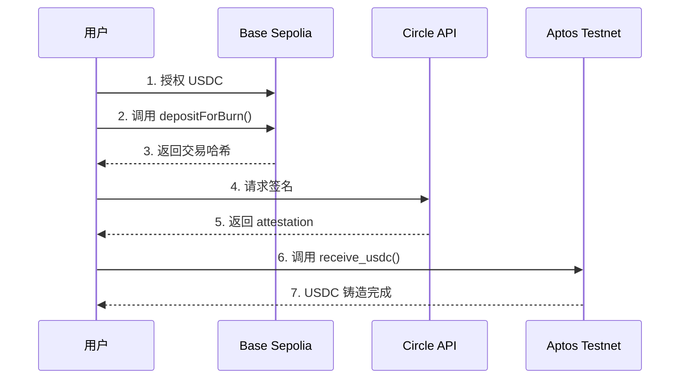

# Saffron - 跨链 USDC 转账应用 🌉

<div align="center">

**基于 Circle CCTP 的 Base ↔️ Aptos 跨链 USDC 转账解决方案**

[](https://expo.dev)
[](https://reactnative.dev/)
[](https://aptoslabs.com/)
[](https://www.circle.com/en/cross-chain-transfer-protocol)

</div>

---

## 📖 项目简介

Saffron 是一个基于 **Circle CCTP (Cross-Chain Transfer Protocol)** 的跨链 USDC 转账应用。它允许用户在 **Base Sepolia** 和 **Aptos Testnet** 之间无缝转移 USDC，提供安全、快速、低成本的跨链体验。

### 核心特性

- 🔐 **安全可靠**：基于 Circle 官方 CCTP 协议
- ⚡ **快速到账**：跨链转账通常在几分钟内完成
- 💰 **低成本**：仅需支付源链和目标链的 gas 费用
- 📱 **移动优先**：使用 Expo + React Native 构建，支持 iOS/Android/Web
- 🎨 **现代 UI**：Material Design 风格，支持深色模式
- 🔗 **多钱包支持**：集成 Petra、OKX 等主流钱包

---

## 🚀 快速开始

### 前置要求

- Node.js >= 18.x
- npm 或 yarn
- [Expo Go](https://expo.dev/go) App（用于移动设备测试）
- [Petra 钱包](https://petra.app/)（用于 Aptos 交易）
- [MetaMask](https://metamask.io/)（用于 Base 交易）

### 安装依赖

```bash
# 克隆仓库
git clone <repository-url>
cd Saffron

# 安装依赖
npm install
```

### 启动应用

```bash
# 开发模式
npx expo start

# 在特定平台运行
npx expo start --android    # Android
npx expo start --ios        # iOS  
npx expo start --web        # Web
```

### 扫码运行

1. 启动后会显示二维码
2. 使用 Expo Go App 扫描二维码
3. 应用将在您的手机上加载

---

## 🏗️ 技术架构

### 前端技术栈

```json
{
  "框架": "React Native + Expo",
  "语言": "TypeScript",
  "导航": "Expo Router (文件路由)",
  "样式": "React Native StyleSheet",
  "钱包适配": "@aptos-labs/wallet-adapter-react",
  "区块链交互": "@aptos-labs/ts-sdk + ethers.js"
}
```

### 智能合约

#### Aptos 链合约

**CCTP Wrapper 合约**（我们部署的）
- **地址**: `0x96feac302e3b9c0cb53890aa2b5d4e3c1d23625fe621f05d8aa736d620627ffc`
- **模块**: `cctp_wrapper::wrapper`
- **功能**: 包装 Circle CCTP 的 `public fun` 为 `public entry fun`，使 Petra 钱包可以直接调用
- **部署交易**: [查看](https://explorer.aptoslabs.com/txn/0x64edcd13a9b8367a3474563c3b620260aceef57dccc1971225c933bdfad32848?network=testnet)
- **部署者**: `0x96feac302e3b9c0cb53890aa2b5d4e3c1d23625fe621f05d8aa736d620627ffc`

**Circle CCTP 官方合约**（链上已部署）
- **Message Transmitter**: `0x081e86cebf457a0c6004f35bd648a2794698f52e0dde09a48619dcd3d4cc23d9`
- **Token Messenger**: `0x5f9b937419dda90aa06c1836b7847f65bbbe3f1217567758dc2488be31a477b9`
- **USDC Token**: `0x69091fbab5f7d635ee7ac5098cf0c1efbe31d68fec0f2cd565e8d168daf52832`

#### Base Sepolia 链合约

- **USDC Token**: `0x036CbD53842c5426634e7929541eC2318f3dCF7e`
- **Token Messenger**: `0x9f3B8679c73C2Fef8b59B4f3444d4e156fb70AA5`
- **Message Transmitter**: `0x7865fAfC2db2093669d92c0F33AeEF291086BEFD`

---

## 🔄 跨链流程详解

### Base → Aptos（发送 USDC）



#### 详细步骤

1. **授权 USDC** (Base 链)
   ```typescript
   // 用户授权 TokenMessenger 合约使用 USDC
   await usdcContract.approve(tokenMessengerAddress, amount);
   ```

2. **燃烧 USDC** (Base 链)
   ```typescript
   // 调用 depositForBurn，燃烧 Base 链上的 USDC
   const tx = await tokenMessenger.depositForBurn(
     amount,              // 转账金额
     destinationDomain,   // 目标链域 ID (Aptos = 9)
     recipientAddress,    // Aptos 接收地址（32 字节）
     usdcAddress          // USDC 代币地址
   );
   ```

3. **获取 Circle 签名**
   ```typescript
   // 轮询 Circle Attestation API
   const attestation = await fetch(
     `https://iris-api-sandbox.circle.com/attestations/${messageHash}`
   );
   ```

4. **在 Aptos 铸造 USDC**
   ```typescript
   // 调用我们的包装合约
   await wallet.signAndSubmitTransaction({
     function: `${WRAPPER_ADDRESS}::wrapper::receive_usdc`,
     type_arguments: [],
     arguments: [
       messageBytes,    // CCTP 消息
       attestation      // Circle 签名
     ]
   });
   ```

### Aptos → Base（接收 USDC）

目前 Aptos 链上的 CCTP 合约暂不支持 `depositForBurn`，仅支持接收（未来可能开放）。

---

## 📁 项目结构

```
Saffron/
├── app/                      # Expo Router 页面
│   └── (tabs)/
│       ├── index.tsx         # 主页面（交易界面）
│       └── explore.tsx       # 探索页面
├── api/                      # API 抽象层
│   ├── index.ts              # Saffron API 主入口
│   └── cctp.ts               # CCTP 跨链 API
├── services/                 # 业务逻辑层
│   ├── aptos-cctp-receiver.ts # Aptos 接收服务
│   └── wallets.ts            # 钱包管理服务
├── constants/                # 常量配置
│   └── contracts.ts          # 合约地址配置
├── components/               # UI 组件
│   ├── PreviewModal.tsx      # 交易预览弹窗
│   ├── themed-text.tsx       # 主题化文本
│   └── themed-view.tsx       # 主题化视图
├── assets/                   # 静态资源
│   └── cctp_script.mv        # Move 脚本（已弃用）
└── package.json              # 依赖配置
```

---

## 💻 使用指南

### 1. 准备钱包

#### Aptos 钱包（Petra）
1. 安装 [Petra Chrome 扩展](https://petra.app/)
2. 创建或导入钱包
3. 切换到 **Testnet** 网络
4. 领取测试币：https://aptoslabs.com/testnet-faucet

#### Base 钱包（MetaMask）
1. 安装 [MetaMask](https://metamask.io/)
2. 添加 Base Sepolia 网络：
   - 网络名称: `Base Sepolia`
   - RPC URL: `https://sepolia.base.org`
   - Chain ID: `84532`
   - Symbol: `ETH`
3. 领取测试 ETH：https://www.coinbase.com/faucets/base-ethereum-goerli-faucet
4. 领取测试 USDC：https://faucet.circle.com/

### 2. 跨链转账

#### 在应用中输入命令

应用使用自然语言处理，支持以下命令格式：

```
# 跨链到 Aptos
send 10 usdc from base to aptos to <aptos-address>

# 示例
send 5 usdc from base to aptos to 0x1234...
```

#### 转账流程

1. **输入命令** → 应用解析意图
2. **预览交易** → 确认金额、地址、手续费
3. **连接钱包** → 自动连接 Petra 和 MetaMask
4. **授权 USDC** → 在 MetaMask 中批准授权
5. **燃烧 USDC** → 在 Base 链上燃烧 USDC
6. **等待签名** → 约 20 秒获取 Circle 签名
7. **铸造 USDC** → 在 Aptos 链上铸造 USDC
8. **完成** → USDC 到账 Aptos 地址 ✅

### 3. 查看交易历史

应用会自动保存交易记录，包括：
- 交易类型（跨链、交易、充值等）
- 交易金额和代币
- 交易状态（进行中、完成、失败）
- 交易时间戳

---

## 🛠️ 开发指南

### 环境配置

```bash
# 配置文件位置
constants/contracts.ts       # 合约地址
services/aptos-cctp-receiver.ts  # Aptos 配置
```

### 修改合约地址

如果您部署了自己的合约，修改 `constants/contracts.ts`：

```typescript
export const APTOS_TESTNET_CONTRACTS = {
  messageTransmitter: '0x...',  // Circle 官方合约
  tokenMessenger: '0x...',      // Circle 官方合约
  usdc: '0x...',                // Circle 官方 USDC
  cctpWrapper: '0x...',         // 您的包装合约地址
};
```

### 调试技巧

1. **查看详细日志**
   ```typescript
   // 在 services/aptos-cctp-receiver.ts 中
   console.log('[CCTP]', '详细日志');
   ```

2. **测试网区块链浏览器**
   - Aptos: https://explorer.aptoslabs.com/?network=testnet
   - Base: https://sepolia.basescan.org/

3. **CCTP 监控**
   - Circle 测试网: https://iris-api-sandbox.circle.com/

### 常见问题

#### Q1: 钱包连接失败？
**A**: 确保：
- Petra 钱包已切换到 Testnet
- 浏览器允许弹窗
- 钱包插件已启用

#### Q2: 交易失败："接收地址未注册 USDC"？
**A**: 应用会自动注册，但如果失败，手动注册：
```bash
aptos move run \
  --function-id 0x1::managed_coin::register \
  --type-args 0x69091fbab5f7d635ee7ac5098cf0c1efbe31d68fec0f2cd565e8d168daf52832::usdc::USDC
```

#### Q3: Circle 签名超时？
**A**: 
- 网络问题，等待更长时间
- 检查交易是否在 Base 链上成功
- Circle 测试网偶尔不稳定，稍后重试

#### Q4: Gas 费用估算错误？
**A**: Aptos 链可能网络拥堵，增加 gas_unit_price：
```typescript
maxGasAmount: 300000,  // 增加 gas 限制
gasUnitPrice: 150,     // 提高 gas 单价
```

---

## 📚 相关文档

### Circle CCTP
- [官方文档](https://developers.circle.com/stablecoins/docs/cctp-getting-started)
- [Aptos 集成指南](https://developers.circle.com/stablecoins/docs/cctp-aptos-integration)
- [测试网 Faucet](https://faucet.circle.com/)

### Aptos 开发
- [Aptos 文档](https://aptos.dev/)
- [Move 语言教程](https://move-language.github.io/move/)
- [Aptos SDK](https://aptos.dev/sdks/ts-sdk/)

### Expo & React Native
- [Expo 文档](https://docs.expo.dev/)
- [React Native 文档](https://reactnative.dev/)
- [Expo Router](https://docs.expo.dev/router/introduction/)

---

## 🗂️ 合约仓库

智能合约代码位于 `../Saffron-contract/` 目录：

```
Saffron-contract/
├── cctp-wrapper/              # CCTP 包装合约
│   ├── sources/
│   │   └── cctp_wrapper.move  # 主合约源码
│   ├── Move.toml              # 合约配置
│   └── DEPLOY_GUIDE.md        # 部署指南
└── corss/                     # 跨链测试工具
    └── examples/
        └── test-cctp-flow.ts  # 完整流程测试
```

### 部署您自己的合约

```bash
cd ../Saffron-contract/cctp-wrapper

# 配置 Move.toml 中的地址
vim Move.toml

# 编译合约
aptos move compile

# 部署合约
aptos move publish

# 更新前端配置
# 将部署地址写入 Saffron/constants/contracts.ts
```

---

## 👥 贡献者

- **部署者地址**: `0x96feac302e3b9c0cb53890aa2b5d4e3c1d23625fe621f05d8aa736d620627ffc`
- **合约地址**: `0x96feac302e3b9c0cb53890aa2b5d4e3c1d23625fe621f05d8aa736d620627ffc`
- **网络**: Aptos Testnet

---

## 📄 许可证

本项目基于 MIT 许可证开源。

---

## 🎯 路线图

- [x] Base → Aptos 跨链转账
- [x] Petra 钱包集成
- [x] 自动注册 USDC CoinStore
- [x] 交易历史记录
- [ ] Aptos → Base 跨链转账（待 Circle 支持）
- [ ] 批量转账功能
- [ ] 多语言支持
- [ ] 主网部署
- [ ] 支持更多链（Ethereum、Polygon 等）

---

## 💡 致谢

- **Circle** - 提供 CCTP 协议
- **Aptos Labs** - 提供区块链基础设施
- **Expo** - 提供优秀的移动开发框架
- **社区贡献者** - 感谢所有提出建议和贡献代码的开发者

---

<div align="center">

**🌉 让跨链转账像发短信一样简单 🌉**

Made with ❤️ by Saffron Team

</div>
